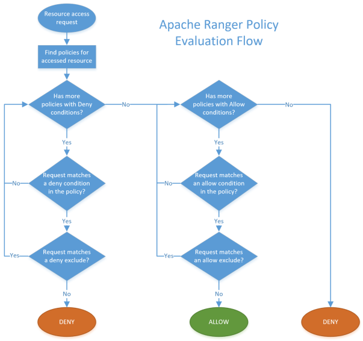
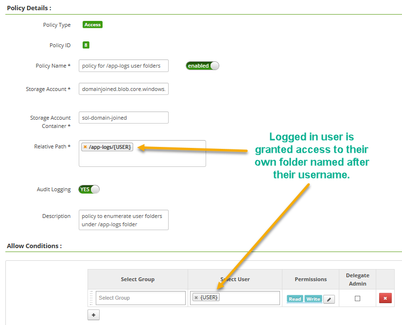
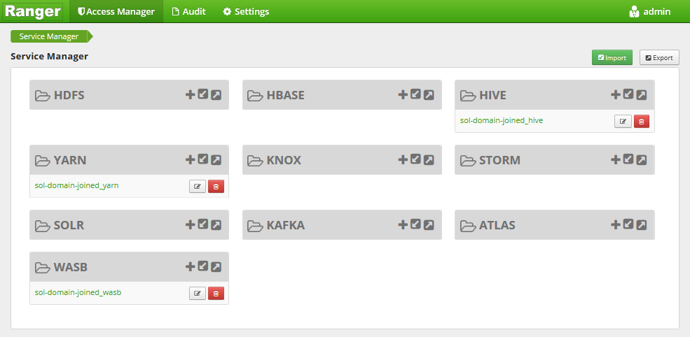
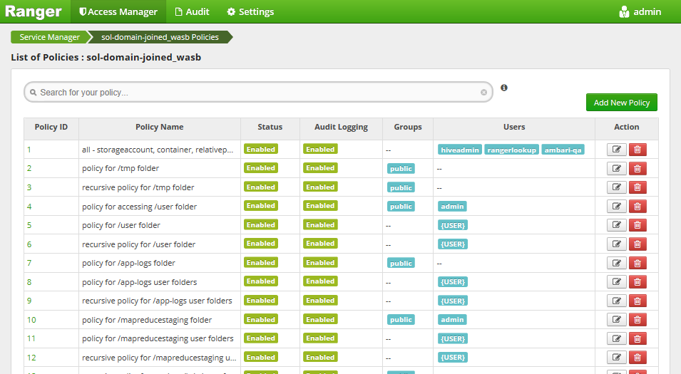
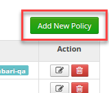
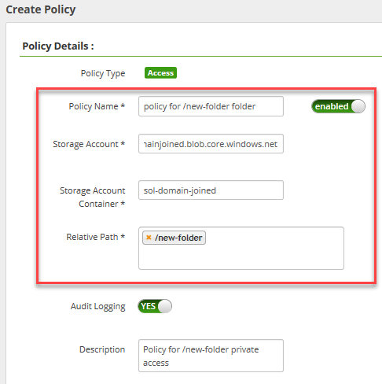
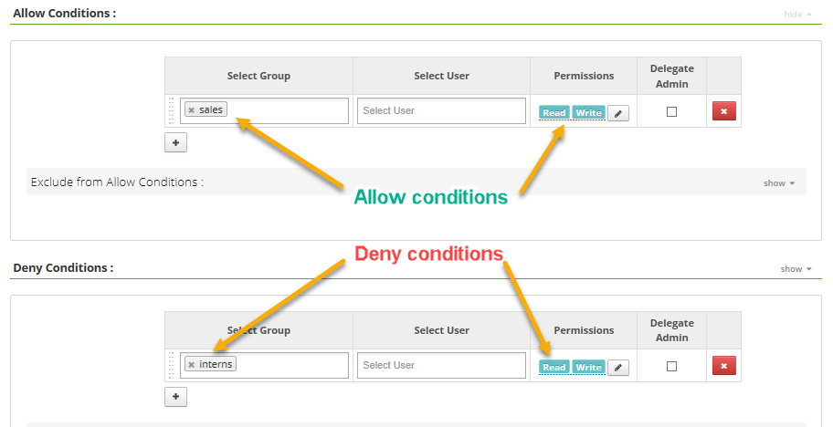
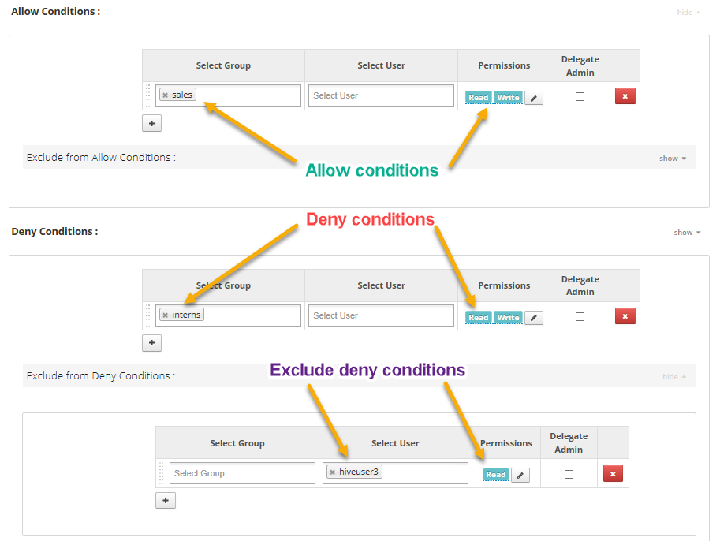

# Add ACLs for Users at the File and Folder Levels

[Domain-joined HDInsight clusters](hdinsight-domain-joined-introduction.md) take advantage of strong authentication with Azure Active Directory (Azure AD) users, as well as use role-based access control (RBAC) policies for various services, such as YARN and Hive. If your default data store for your cluster is Azure Storage, or WASB (Windows Azure Storage Blobs), you can enforce file and folder-level permissions as well. Doing so allows you to control access to the cluster's files by assigning your [synchronized Azure AD users and groups](hdinsight-sync-aad-users-to-cluster.md) through Apache Ranger.

HDInsight domain-joined clusters' Apache Ranger instance comes preconfigured with the **Ranger-WASB** service. This service is a policy management engine that is similar to Ranger-HDFS from a user interface standpoint, but varies in its application and enforcement of Ranger's policy specifications. Namely, if the resource request does not have a matching Ranger policy, the default response is DENY. In other words, Ranger does not hand off permission checking to WASB.

## Permission and policy model

Resource access requests are evaluated using the following flow:



DENY rules are evaluated first, followed by ALLOW rules. At the end of matching, a DENY is returned if no policies are matched.

### USER variable

When assigning policies for each user to access a corresponding /user/{username} directory, you may use the `{USER}` variable. For example:

```
resource: path=/app-logs/{USER}, user: {USER}, recursive=true, permissions: all, delegateAdmin=true
```

The above policy grants users access to their own subfolder underneath the `/app-logs/` directory. This is what the policy looks like in the Ranger user interface:



### Policy model examples

This table shows a few examples of how the policy model works, for clarification:

| Ranger Policy | Existing FS Hierarchy | User-request | Result |
| -- | -- | -- | -- |
| /data/finance/, bob, WRITE | /data | bob, Create file /data/finance/mydatafile.txt | ALLOW - Intermediate folder ‘finance’ is created, because of ancestor check |
| /data/finance/, bob, WRITE | /data | alice, Create file /data/finance/mydatafile.txt | DENY - No matching policy |
| /data/finance*, bob, WRITE | /data | bob, Create file /data/finance/mydatafile.txt | ALLOW - Missing `/` after 'finance' in policy; recursive policy not required, but it will work because of the recursive policy in this case |
| /data/finance/mydatafile.txt, bob, WRITE | /data | bob, Create file /data/finance/mydatafile.txt | DENY - Ancestor check on '/data' will fail because there is no policy |
| /data/finance/mydatafile.txt, bob, WRITE | /data/finance | bob, Create file /data/finance/mydatafile.txt | DENY - No policy for ancestor check on '/data/finance' |

Permissions are required at different levels (at the folder level or at the file level), based on the type of operation. For example, a "read/open" call requires read-access at the file level, whereas a "create" call requires permissions at the ancestor folder level.

### Wildcards (*)

When wildcards ("*") are present in the path for a policy, it doesn't only apply to one directory, it also applies to the entire subtree. This is known as "recursion", which some may be familiar with implementing via a `recurse-flag`. In Ranger-WASB, the wildcard implicitly means recursion as well as a partial name match.

## Manage file and folder-level permissions with Apache Ranger

If you have not already done so, follow [these instructions](hdinsight-domain-joined-configure) to provision a new domain-joined cluster.

Open Ranger by browsing to **`https://<YOUR CLUSTER NAME>.azurehdinsight.net/ranger/`**, substituting `<YOUR CLUSTER NAME>`. Enter your cluster administrator username and password that you defined when creating your cluster, when prompted.

Once signed in, you should see the Ranger dashboard:



To view current file and folder permissions for your cluster's associated Azure Storage account, click the **CLUSTERNAME_wasb** link located within the WASB panel.


This will take you to your list of policies. As you can see, several policies are added out-of-the-box. Here you can see whether the policy is enabled, if audit logging is configured, what the assigned groups and users are, as well as the policy name and id. In the right-hand Action colum are two buttons for each policy: Edit and Delete.



### Adding a new policy

1. On the top-right section of the WASB policies page, click **Add New Policy**.

    

2. Enter a descriptive **Policy Name**. Specify the Azure **Storage Account** for your cluster (ACCOUNT_NAME.blob.core.windows.net). Enter the **Storage Account Container** specified when you created your cluster. Type in the **Relative Path** (relative to the cluster) for your folder or file.



3. Below the form, specify your **Allow Conditions** for this new resource. You may select groups and/or users, and their permissions. In this case, we're allowing all users in the `sales` group to have read/write access.


4. Click the **Save** button to save your new policy.

### Example policy conditions

Given the Apache Ranger policy evaluation flow, as shown in the flowchart at the top of the page, it is possible to use any combination of allow and deny conditions to meet your needs. Here are a few examples:

1. Allow all sales users, but no interns:



2. Allow all sales users, deny all interns, except for an intern whose user name is "hiveuser3", who should have Read access:



## Next steps

In this article, we covered the steps necessary to add and edit user and group access policies to Azure Storage (WASB) files and folders. Because domain-joined clusters come preconfigured with many policies out-of-the-box, feel free to look at the details of those policies to learn different ways policies can be expressed in Apache Ranger.

* [Configure Hive policies in Domain-joined HDInsight](hdinsight-domain-joined-run-hive.md)
* [Manage Domain-joined HDInsight clusters](hdinsight-domain-joined-manage.md)
* [Manage Ambari - Authorize Users to Ambari](hdinsight-authorize-users-to-ambari.md)
* [Synchronized Azure AD users and groups](hdinsight-sync-aad-users-to-cluster.md)
