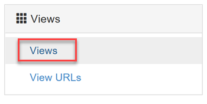
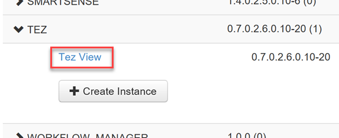
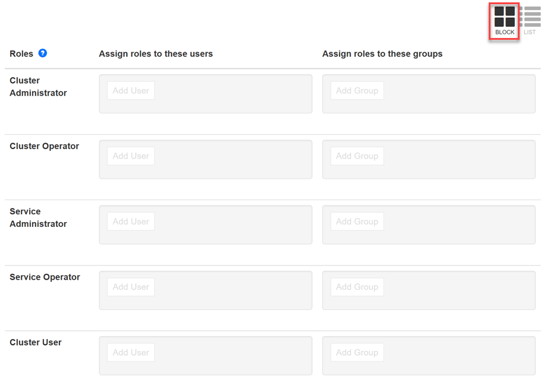
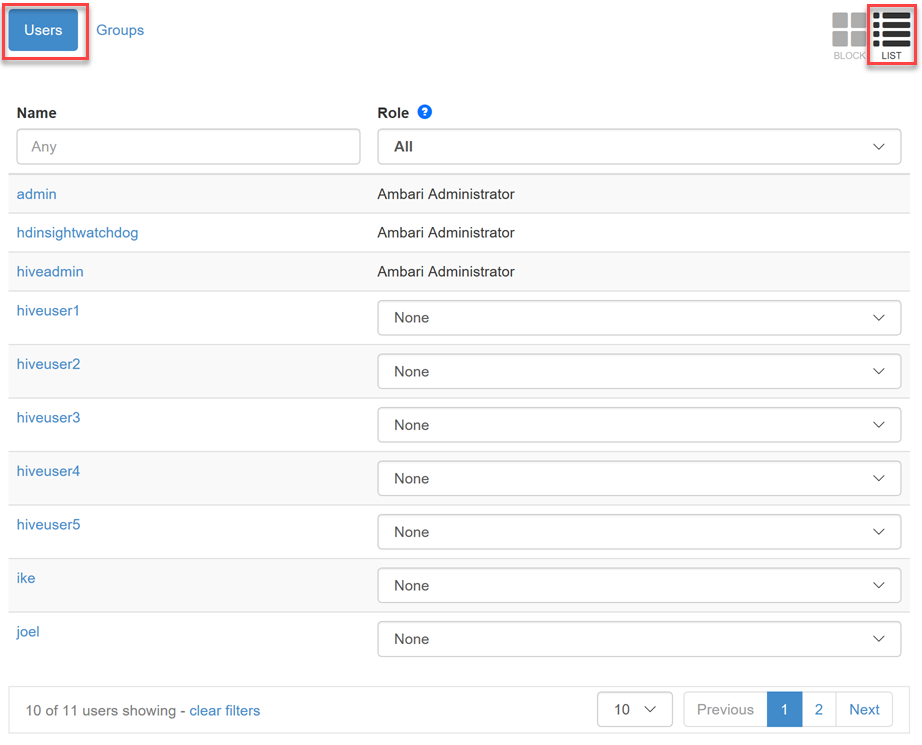
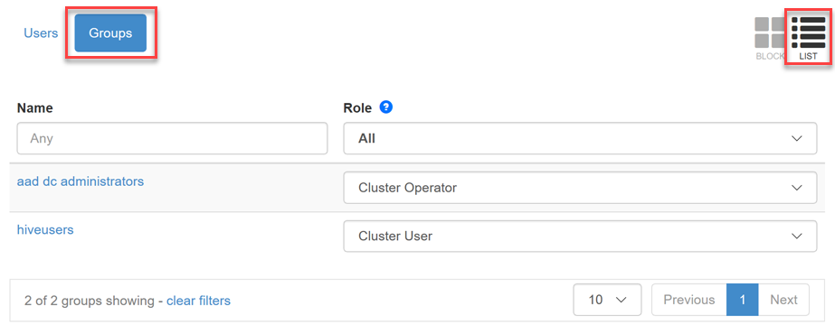
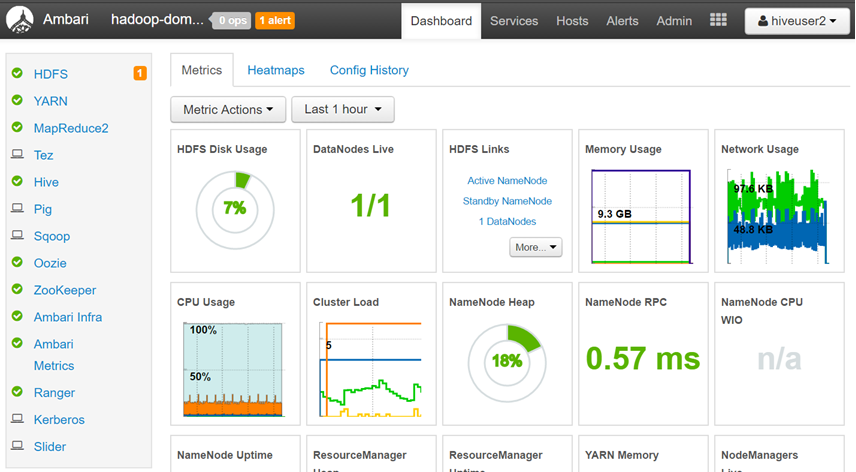

# Manage Ambari - Authorize Users to Ambari

[Domain-joined HDInsight clusters](hdinsight-domain-joined-intro) provide enterprise-grade capabilities, including Azure Active Directory-based authentication. You can [synchronize new users](hdinsight-sync-aad-users-to-cluster) added to Azure AD groups that have been provided access to the cluster, allowing those specific users to perform certain actions. Currently, working with users, groups, and permissions in Ambari is only supported when using a domain-joined HDInsight cluster.

Active Directory users can log on to the cluster nodes using their domain credentials. They can also use their domain credentials to authenticate with other approved endpoints like Hue, Ambari Views, ODBC, JDBC, PowerShell and REST APIs to interact with the cluster.

> [!WARNING]
> Do not change the password of the Ambari watchdog (hdinsightwatchdog) on your Linux-based HDInsight cluster. Changing the password breaks the ability to use script actions or perform scaling operations with your cluster.

If you have not already done so, follow [these instructions](hdinsight-domain-joined-configure) to provision a new domain-joined cluster.

Most of the actions in this article will be performed from the **Ambari Management Page** on the [Ambari Web UI](hdinsight-hadoop-manage-ambari). To get there, browse to **`https://<YOUR CLUSTER NAME>.azurehdinsight.net`**, substituting `<YOUR CLUSTER NAME>`. Enter your cluster administrator username and password that you defined when creating your cluster, when prompted. Then, from the Ambari dashboard, select **Manage Ambari** underneath the **admin** menu.

## Grant permissions to Hive views

Ambari comes with view instances for, among other things, Hive and Tez. To grant access to one or more Hive view instances, go to the **Ambari Management Page** (following the steps above).

1. From the management page, select the **Views** link under the **Views** menu heading on the left.

2. On the Views page, expand the **HIVE** row. By default, you will see a Hive view that is auto-created when the Hive services is added to the cluster. **Select** the listed Hive view. Notice that you have the option to create more Hive view instances if desired.

3. Scroll toward the bottom of the View page. Under the *Permissions* section, you have two options for granting domain users permissions to the view:

**Grant permission to these users**

**Grant permission to these groups**

4. To add a user, click the **Add User** button.

    * Start typing the user name. As you type, you will see a dropdown list of matching names.

    

    * Select, or finish typing, the user name. There's a box named **New** next to the user's name you added. This is to add additional users, if desired. When finished, **click the blue checkbox** to save your changes.

    

5. To add a group, click the **Add Group** button.

    * Start typing the group name. As with adding a user, when you start to type, you will see a dropdown list of matching names.

    * The process of selecting a suggested group name, or typing the whole name, as well as adding more than one group, is the same as for adding users. **Click the blue checkbox** to save your changes when done.

    

Adding users directly to a view is useful when you want to assign permissions to a user to use that view, but do not necessarily want them to be a member of a group that has other permissions the user should not have. In practice, however, it is preferable to assign permissions to groups, as it reduces the amount of administrative overhead managing user access.

## Grant permissions to Tez views

The Tez view instances allow the users to monitor and debug all Tez jobs, submitted by Hive queries and Pig scripts. The default Tez view instance is also auto-generated when the cluster is provisioned.

To assign users and groups to a Tez view instance, expand the **TEZ** row on the Views page, as detailed in the steps for granting permissions to Hive views.

Repeat steps 3 - 5 in the previous section to add users or groups.

## Assign users to Roles

There are five security roles to which you can assign users and groups: Cluster Administrator, Cluster Operator, Service Administrator, Service Operator, and Cluster User.

To manage roles, go to the **Ambari Management Page**, then select the **Roles** link within the *Clusters* menu group on the left.

To see the list of permissions provided by each role, click on the blue question mark next to the **Roles** table header on the Roles page.

On this page, there are two different views you can use to manage roles for users and groups: Block and List.

Block displays each role in its own role, providing the familiar **Assign roles to these users** and **Assign roles to these groups** options.

List provides quick editing capabilities in two categories: Users and Groups.

The Users category of the List view displays a list of all users, allowing you to select a role for each user in the dropdown list.

The Groups category of the List view displays all of the groups, and the role assigned to each group. In our example, the list of groups are syncrhonized from our Azure AD groups that were specified in the **Access user group** property of the Domain settings during cluster creation. Please see the [Create HDInsight cluster](hdinsight-domain-joined-configure#create-hdinsight-cluster) section of the [Configure Domain-joined HDInsight clusters](hdinsight-domain-joined-configure) article for reference.

In the screenshot above, the **hiveusers** group is assigned the *Cluster User* role. This is essentially a read-only role that allows the users of that group to view service configurations and cluster metrics, without being able to alter any related settings.

## Logging in to Ambari as a user only assigned to views

We have assigned our Azure AD domain user, **hiveuser1**, permissions to Hive and Tez views. When we launch the Ambari Web UI and enter this user's domain credentials (using the Azure AD user name in email format and password), the user is redirected to the Ambari Views page. From here, they can select each view to which they have access. They cannot visit any other part of the site, such as the dashboard, services, hosts, alerts, and admin pages.

## Logging in as a user assigned to the Cluster User role

We have assigned our Azure AD domain user, **hiveuser2**, to the *Cluster User* role. When we log in to the Ambari Web UI with this user, we are able to access the dashboard and all of the menu items. However, not all of the same options available to an admin-level user are available to this one. For instance, hiveuser2 can view configurations for each of the services, but cannot edit them.

## Next steps

In this article, we learned how to assign domain users to Views and Roles in Ambari. Please use the links below to find out more about Domain-joined HDInsight clusters, and operations available to domain users.

* [Configure Hive policies in Domain-joined HDInsight](hdinsight-domain-joined-run-hive)
* [Manage Domain-joined HDInsight clusters](hdinsight-domain-joined-manage)
* [Synchronize Azure AD users to the cluster](hdinsight-sync-aad-users-to-cluster)
* [Use the Hive View with Hadoop in HDInsight](hdinsight-hadoop-use-hive-ambari-view)
