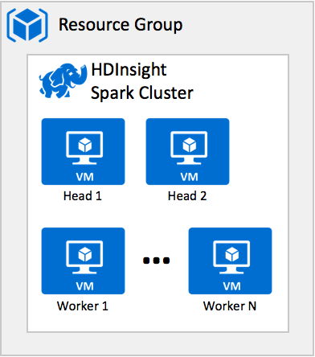
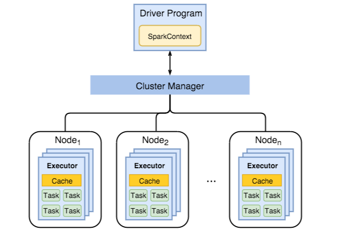
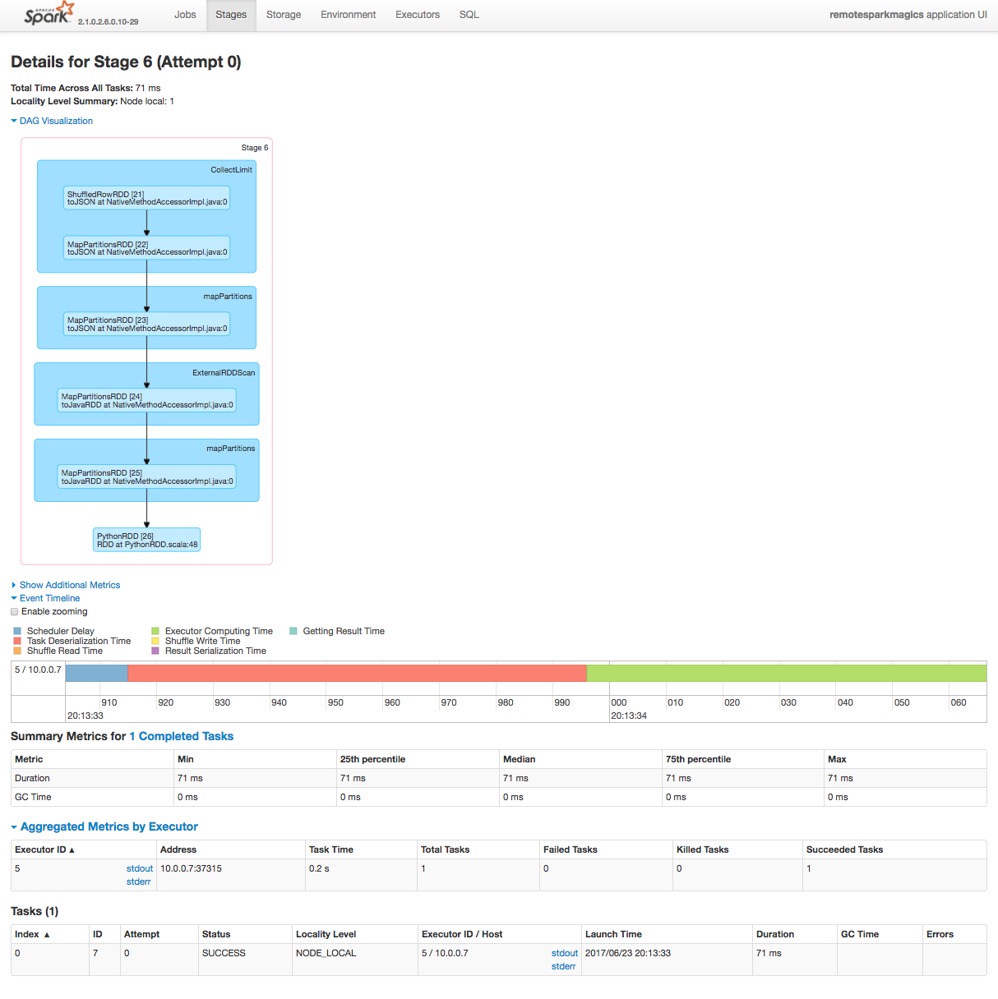

# Architecture of Hadoop on HDInsight
Hadoop includes two core components, the High Density File System (HDFS) which provides storage and Yet Another Resource Negotiator (YARN) which provides processing. With storage and processing capabilities a cluster becomes capable of running MapReduce programs that perform the desired data processing.

As described in [HDInsight Architecture](./hdinsight-architecture.md), HDFS is not typically deployed within the HDInsight cluster to provide storage. Instead, an HDFS compatible interface layer is exposed to Hadoop ecosystem components and the actual storage capability is provide by either Azure Storage or Data Lake Store. In the Hadoop case, MapReduce jobs executing on the HDInsight cluster run as if HDFS were actually present and require no changes to support their storage needs. This simplifies the discussion of the architecture of Hadoop on HDInsight, as storage is outsourced, but the processing which uses YARN remains a core component. This article introduces YARN and how it coordinates the execution of applications on HDInsight.

## YARN basics 
YARN is what governs and orchestrates data processing in Hadoop. It is structured as having two core services: the ResourceManager and the NodeManager. These two services run as processes on nodes in the cluster. 

### ResourceManager, NodeManager and ApplicationMaster
The ResourceManager grants cluster compute resources to applications like MapReduce jobs. It grants these resources in for the form of containers, which are themselves a way to describe an allocation of CPU cores and RAM memory. If you combined all the resources available in  cluster and then distributed it in blocks of a predefined number of cores and memory, each block of resources is a container. Each node in the cluster has a capacity for a certain number of containers and therefore the cluster has a fixed limit on the number of containers available. The allotment of resources in a container is configurable. 

When a MapReduce application needs to run on a cluster, it is the ResourceManager that provides it the containers in which to execute. The ResourceManager tracks the status of running applications, available cluster capacity and tracks applications as they complete and release the resources they utilized. 

The ResourceManager also runs a web server process that provides a web user interface you can access to monitor the status of applications. 

When a user submits a MapReduce application to run on the cluster, it is submitted to the ResourceManager. In turn, the ResourceManager allocates a container on an available NodeManager nodes. The NodeManager nodes are where the application actually executes. In the first container allocated is run a special application called the ApplicationMaster. This ApplicationMaster is responsible for acquiring resources, in the form of subsequent containers, needed to run the submitted application. To do this, the ApplicationMaster examines the stages of the application (e.g, the map stage and reduce stage), factors in how much data needs to be processed and then requests the resources from the ResourceManager on behalf of the application (in a process called "negotiating"). The ResourceManager in turn grants resources from the NodeManagers in the cluster to the ApplicationMaster for it to use in executing the application. 

These NodeManagers run the tasks that make up the application and report their progress and status back to ApplicationMaster. The ApplicationMaster, in turn reports the status of the application back to the ResourceManager. The ResourceManager, in turn, returns any results to the client.

## YARN on HDInsight
All HDInsight cluster types deploy YARN. The ResourceManger is deployed in a high-availability fashion having a primary and secondary instance, which run on the first and second head nodes within the cluster respectively. Only the one instance of the ResourceManager is active at a time. The NodeManager instances run across the available Worker Nodes in the cluster.

 

 ---

 ## Lifecycle of a Spark Job

### What is Apache Spark?

Apache Spark is an open-source processing framework that runs large-scale data analytics applications. Spark is built on an in-memory compute engine, which enables high-performance querying on big data. It takes advantage of a parallel data-processing framework that persists data in-memory and disk if needed. This allows Spark to deliver 100-times faster speed and a common execution model for tasks such as extract, transform, load (ETL), batch, interactive queries and others on data in an Apache Hadoop Distributed File System (HDFS). Azure makes Apache Spark easy and cost effective to deploy with no hardware to buy, no software to configure, a full notebook experience for authoring compelling narratives and integration with partner business intelligence tools.

Spark includes an integrated set of APIs which allows for many different types of interaction, processing and query of associated data. These include SparkSQL, SparkML and others. Shown below is the Spark architecture for reference.

### Architecture of Spark on HDInsight

Shown below is a diagram with the core components of Spark on HDInsight.  When you setup your HDInsight cluster on Azure, you select a cluster of type `Spark` and then the version of Spark as well as the number and configuration of head and worker nodes for your cluster.  Given Spark's use of node memory for job processing, it's particularly important to understand, evaluate and tune your cluster configuration settings so that your Spark Jobs will run as expected.

In order to understand the lifecycle of a Spark Job, you'll also need to consider Spark objects in your cluster.  As shown below, Spark uses a Driver Program, which runs the SparkContext along with a cluster manager (YARN) to schedule and run the Spark Jobs submitted to that cluster.  The cluster executes the Spark job steps on the worker nodes.  Each worker node has its own Executor, Cache and list of (job) tasks.  

 ### Understanding Spark Job Steps

 Spark uses an abstraction called a RDD (resiliant distributed dataset) to hold the data that it processes during a Spark job.  The Spark API has evolved and there are now higher level objects, such as DataFrames and DataSets that operate on top of RDDs and provide more functionality for developers, i.e. strongly-typed objects, etc...

 After data is loaded into RDDs on the worker nodes, then the DAG (Directed Acyclic Graph) scheduler coordinates the set of tasks that the Spark Job requires and sends that list to the Task Scheduler on the Cluster Manager.  Tasks are then distributed to Executors (on various nodes) and run on resources on those nodes.  This process is illustrated below.

 

 You can monitor the progress of Spark Jobs via several monitoring UIs that are available for HDInsight.  Most commonly, you'd first start by taking a look at the YARN UI to locate the job status and tracking URL for the Spark Job(s) of interest.  This is shown below.

 

Clicking on the `Tracking URL` (shown above), opens the Spark UI.  There are a number of views here that allow you to track and monitor the status of your job(s) at a very granular level.  This UI opens to the `Jobs` tab.  As shown below, here you can see a list of jobs run with Job Ids, Descriptions, Time Submitted, Job Duration, Job Steps and Job Tasks.  Here also you can click on a link in the Description column to open a new UI with detailed information about Job step execution overhead.

 

 In the Spark (Job) Stages UI, you have access to highly detailed information about the process and overhead associated with each task in a Spark Job.  Shown below is an expanded view of the Spark Stages UI.  This includes the `DAG Visualization`, `Event Timeline`, `Summary Metrics` and `Aggregated Metrics by Executor` for a single job stage of a Spark Job.  These detailed views are quite useful in determining whether and exactly where Spark Job performance bottlenecks are occuring on your HDInsight Spark cluster.    

 

 After Spark Jobs complete, then job execution information is available in the Spark History Server view.  This view is available via a link in the Azure Portal for HDInsight.

 ---

## Next steps
This article provided an architectural overview of Hadoop on HDInsight. 

* To further explore the architecture of HDInsight, see [HDInsight Architecture](./hdinsight-architecture.md).
* For further details on MapReduce, see [What is MapReduce](https://docs.microsoft.com/azure/hdinsight/hdinsight-use-mapreduce#a-idwhatisawhat-is-mapreduce).
* To run a sample MapReduce application on HDInsight, see [Use MapReduce with Hadoop in HDInsight](https://docs.microsoft.com/azure/hdinsight/hdinsight-use-mapreduce).

