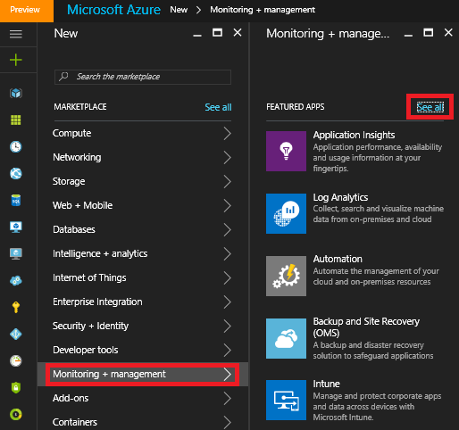
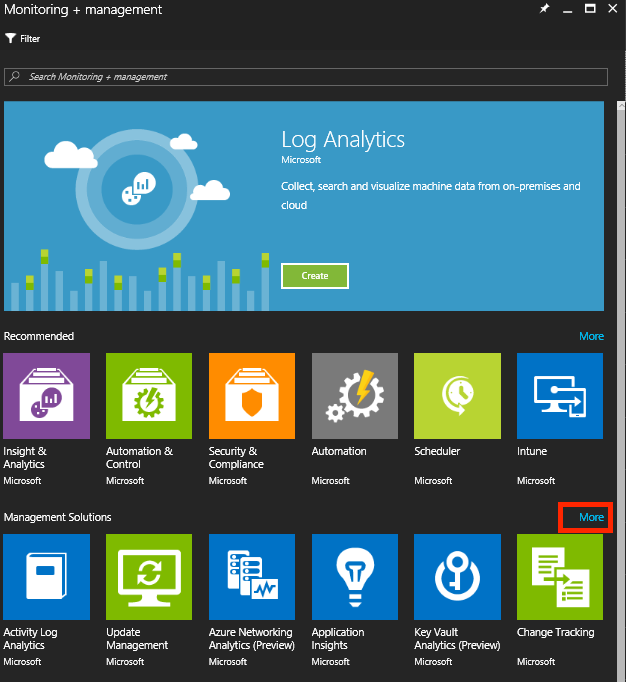
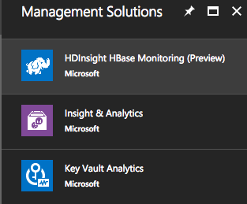
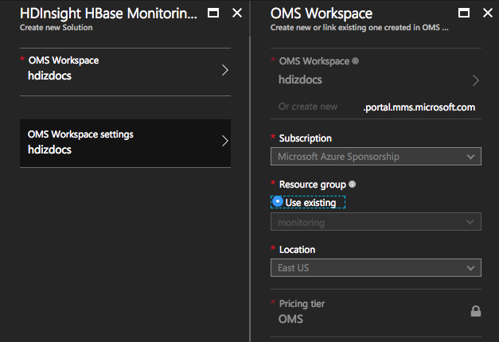
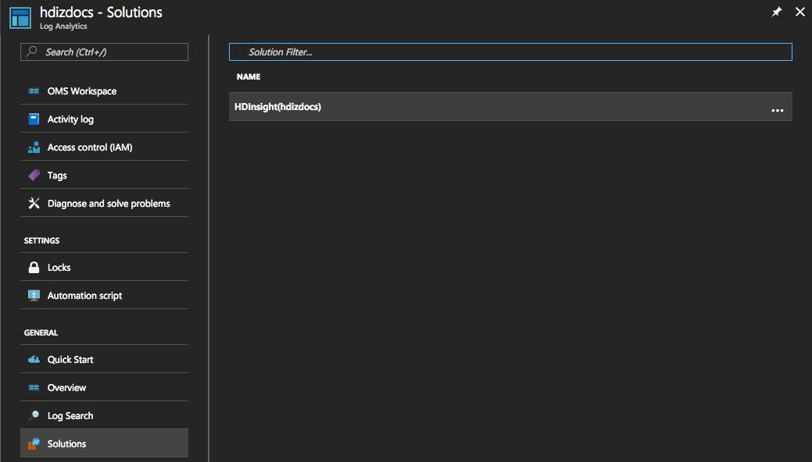
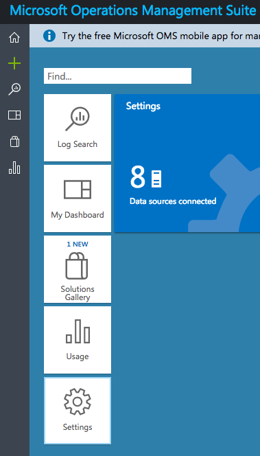
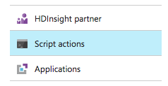
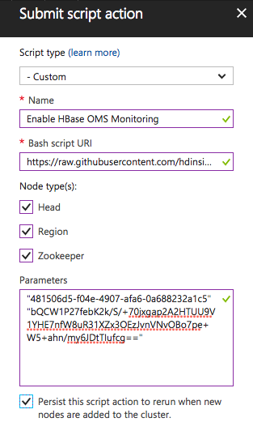
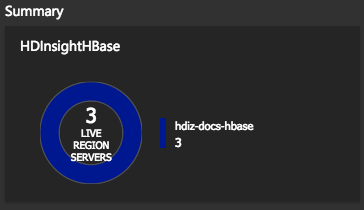
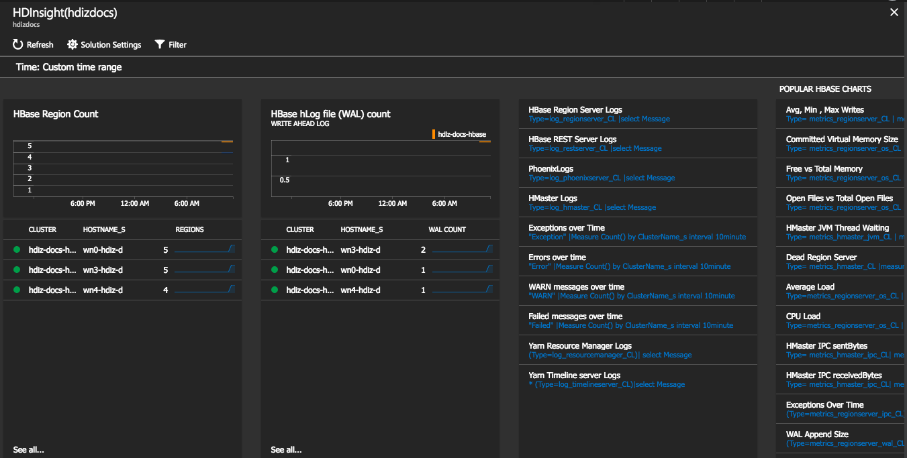

# Monitoring HBase with Operations Management Suite (OMS)

The HDInsight HBase Monitoring solution is a management solution for Azure Log Analytics that collects important HDInsight HBase performance metrics from your HDInsight Cluster nodes and provides the tools to search the metrics, as well HBase-specific visualizations and dashboards. By using the metrics that you collect with the solution, you can create custom monitoring rules and alerts. You can monitor the metrics for multiple HDInsight HBase clusters across multiple Azure subscriptions. 

Log Analytics is a service in [Operations Management Suite (OMS)](https://docs.microsoft.com/azure/operations-management-suite/operations-management-suite-overview) that monitors your cloud and on-premises environments to maintain their availability and performance. It collects data generated by resources in your cloud and on-premises environments and from other monitoring tools to provide analysis across multiple sources. 

[Management solutions](https://docs.microsoft.com/azure/log-analytics/log-analytics-add-solutions) add functionality to OMS, providing additional data and analysis tools to Log Analytics. Log Analytics management solutions are a collection of logic, visualization, and data acquisition rules that provide metrics pivoted around a particular area. They may also define new record types to be collected that can be analyzed with Log Searches or by additional user interface provided by the solution in the dashboard. 

[Insight & Analytics](https://azure.microsoft.com/pricing/details/insight-analytics/) is built on the underlying Log Analytics platform. You can choose to use the Log Analytics capabilities and pay per GB ingested into the service or switch your workspace to the Insight & Analytics tier and pay per node managed by the service. Insight & Analytics offers a superset of the capabilities offered under Log Analytics. The HBase Monitoring solution is available to either Log Analytics or Insight & Analytics.

When you provision the HDInsight HBase Monitoring solution, you will create an OMS workspace. You can think of the workspace as a unique Log Analytics environment with its own data repository, data sources, and solutions. You may create multiple workspaces in your subscription to support multiple environments such as production and test.

## Provision the HDInsight HBase Monitoring management solution
1. Sign in to the [Azure portal](https://portal.azure.com) using your Azure subscription.
2. In the **New** blade under **Marketplace**, select **Monitoring + management**.
3. In the **Monitoring + management** blade, click **See all**.  

      

4. In the listing, look for the **Management Solutions** band. To the right of **Management Solutions**, click **More**.

     

5. In the **Management Solutions** blade, select the HDInsight HBase Monitoring management solution that you want to add to a workspace.  

      
6. In the management solution blade, review information about the management solution, and then click **Create**. 
7. In the *management solution name* blade, select an existing workspace that you want to associate with the management solution or create a new OMS workspace and then select it.
8. Change workspace settings for the Azure subscription, resource group, and location as appropriate. 
      
9. Select **Create**.  
10. To start using the management solution that you've added to your workspace, navigate to **Log Analytics** > ***workspace name*** > **Solutions**. An entry for your management solution is displayed in the list. Click the entry to navigate to the solution.

      

11. The blade for your HDInsight HBase monitoring solution should appear.

     

12. At this point, your Summary tiles will not show any data because you have yet to configure your HDInsight HBase cluster to send data to Log Analytics. 

## Connecting an HDInsight HBase cluster to Log Analytics
Before you can use the tools provided by the HDInsight HBase Monitoring solution, you need to configure your cluster so that it transmits the metrics from its region server, head nodes and ZooKeeper nodes to Log Analytics. This is accomplished by running a Script Action against your HDInsight HBase cluster.

### Acquire Your OMS Workspace ID and Workspace Key
You will need your OMS Workspace ID and Workspace Key to enable the nodes in your cluster to authenticate with Log Analytics. To acquire these values, follow these steps:

1. From your HBase Monitoring blade in the Azure Portal, select Overview.

     

2. Select OMS Portal. This will launch the OMS Portal in a new browser tab or window.

     

3. On the OMS Portal Home, select Settings.

     

4. Select Connected Source, Linux Servers.

     

5. Take note of the Workspace ID and Primary Key values dispalyed, these are the Workspace ID and Workspace Key values you will need for the Script Action.

### Run the Script Action
To enable data collection from your HDInsight HBase cluster, you need to run a Script Action against all the nodes in the cluster. Follow these steps to do so:

1. Navigate to the blade for your HDInsight HBase cluster in the Azure Portal.
2. Select Script Actions.

     

3. Select Submit New.

      

4. In the Submit script action, set the Script type to "- Custom".
5. Provide a name for this script. 
6. For the Bash Script URI, paste in the following URI:

        https://raw.githubusercontent.com/hdinsight/HDInsightOMS/master/monitoring/script2.sh 

7. For the Node types, select all three (Head, Region, ZooKeeper).
8. In the Parameters text box, enter your Workspace ID and your Workspace Key, enclosing each value in quotes and separating the two quoted values with a space. 

        "WorkspaceID" "WorkspaceKey"
    For example:

        "481506d5-f04e-4901-afa6-0a688232a1c1" "bQCW1P27febK2k/S/+70jxgap2A2HTUU9V1YHE7nfW8uR31XZx3OEzJvnVNvOBo7pe+W5+ahn/my6JDtTIufcg=="
9. Select Persist this script action to rerun when new nodes are added to the cluster.

      

10. Select Create.
11. The Script Action will take a few minutes to run. You can monitor its status from Script Actions blade.

      

12. When the Script Action completes, you should see a green checkmark next to the script name in the listing. 

      

## View the HDInsight HBase Monitoring Solution
After the Script Action completes, you should start to see data in the Monitoring Solution within a few minutes. 

1. Within the Azure Portal, navigate to blade for your HDInsight HBase solution. 
2. Select the Overview tab.
3. Under Summary, you should see a tile indicating the count of Region Servers that are being monitored. 

      

4. Select the tile with the region server count. The main dashboard will be displayed. 
5. This Dashboard provides access to statiscs about the Regions, the Write-Ahead-Log (WAL) count in use, a collection of Log Analytics searches (e.g., for Region Server Logs, Phoenix logs, Exceptions, etc.) and a collection of Popular charts that provide visualization of relevant metrics. 

      

6. Selecting any one of these will drill down into the Log Search view where you can refine the query and explore the data in more detail.

## See Also

* You can create alerts against metrics collected by the HDInsight HBase Monitoring management solution, see [Creating Alerts](https://docs.microsoft.com/azure/log-analytics/log-analytics-alerts-creating) for step by step instructions.
* Learn more about how to conduct [Log Searches](https://docs.microsoft.com/azure/log-analytics/log-analytics-log-searches). 

