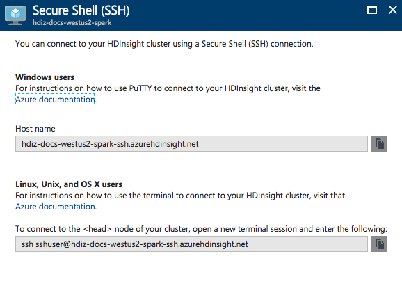

# Run Spark from the Shell
To run Spark interactively, you can use the Spark Shell. This is useful for development and debugging. There are shells for each language supported by Spark, but they all provide the same capability- a REPL (read, execute, print loop) environment for running Spark commands one at a time and viewing the results.

## Get to a Shell via SSH
You access the Spark Shell on HDInsight by connecting to the primary head node of the cluster via SSH. The standard syntax is as follows:

     ssh <sshusername>@<clustername>-ssh.azurehdinsight.net

You can get easily retrieve the complete command for your cluster, from the Azure Portal by following these steps:

1. Log into the [Azure Portal](https://portal.azure.com).
2. Navigate to the blade for your HDInsight Spark cluster.
3. Select Secure Shell (SSH). 

    

4. Copy the provided SSH commmand and run it in the terminal of your choice.  

    

For details on using SSH to connect to HDInsight, see [Use SSH with HDInsight](hdinsight-hadoop-linux-use-ssh-unix.md)

## Run the Shell
Spark provides shells for Scala (spark-shell), Python (pyspark) and R (sparkR) . Within your SSH session to the head node of your HDInsight cluster, you run either

    ./bin/spark-shell

to launch the Scala Spark Shell or

    ./bin/pyspark

to launch the Python Spark Shell or

    ./bin/sparkR 

to launch the R Spark Shell.

Within each shell you can enter Spark commands in the expected langauge for the shell. 

## SparkSession and SparkContext
By default when you run the Spark Shell, instances of SparkSession and SparkContext are automatically instantiated for you.

to access the SparkSession instance, use:

    spark

to access the SparkContext instance, use:

    sc


## Important Shell Parameters
The Spark Shell also support numerous command line parameters. 

If you run the Spark Shell with the switch ``--help`` you will get the full list of commands available (note that some of these switches do not apply instances of Spark Shell, as they may only apply to ```spark-submit``` which the Spark Shell wraps).

| switch | description | example |
| --- | --- | --- |
| --master MASTER_URL | Used to specify the master URL. In HDInsight this should always use the value yarn. | ``--master yarn``|
| --jars JAR_LIST | Comma-separated list of local jars to include on the driver and executor classpaths. In HDInsight, these are paths to the default filesytem in Azure Storage or Data Lake Store. | ``--jars /path/to/examples.jar`` |
| --packages MAVEN_COORDS | Comma-separated list of maven coordinates of jars to include on the driver and executor classpaths. Will search the local maven repo, then maven central and any additional remote repositories given by --repositories. The format for the coordinates should be groupId:artifactId:version. | ``--packages "com.microsoft.azure:azure-eventhubs:0.14.0"``|
| --py-files LIST | Comma-separated list of .zip, .egg, or .py files to place on the PYTHONPATH for Python apps. | ``--pyfiles "samples.py"`` |

## Next Steps
This article covered how to run the various Spark Shells available to each language support by Spark. 

- See [Use Spark with HDInsight](hdinsight-spark-with-hdinsight.md) for an overview of using Spark with HDInsight.
- Read [Use Spark SQL with HDInsight](hdinsight-spark-sql-with-hdinsight.md) to understand how to write applications that use DataFrames from SparkSQL.
- Review [What is Spark Structured Streaming?](hdinsight-spark-streaming-overview.md) to learn how to write application to process streaming data with Spark.

