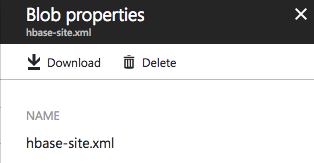
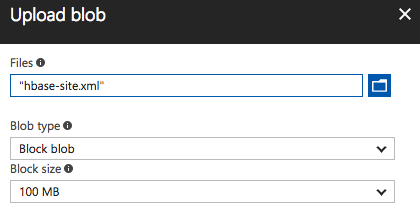

# Using Spark to read and write HBase data

Apache HBase is typically queried either with its low level API of scans, gets and puts or with a SQL syntax using Phoenix. Apache Spark can be used as a convinient and performant alternative way to query and modify data stored by HBase. This is enabled by the use of the Spark HBase Connector. 

This article covers how to setup your HDInsight Spark cluster so that it can query and modify data in you HDInsight HBase cluster using the Spark HBase Connector. 

## Deployment Environment
To begin, you will need two separate HDInsight clusters- one of the HBase cluster type and one of the Spark cluster type with Spark 2.1 (HDI 3.6) installed. The Spark cluster will need to be able to communicate directly with the HBase cluster with minimal latency, so deploying both clusters within the same Virtual Network is the recommended configuration. For instructions on how to deploy an HDInsight cluster into a Virtual Network, see [Create Linux based clusters in HDInsight using the Azure Portal](https://docs.microsoft.com/en-us/azure/hdinsight/hdinsight-hadoop-create-linux-clusters-portal). 

This article assumes you have deployed your Spark and HDInsight cluster into one Virtual Network and that you have SSH access to both. You will also need to have access to the default storage attached to each cluster. 

## Overall Process
The high-level process for enabling your Spark cluster to query your HDInsight cluster is as follows:
1. Acquire the hbase-site.xml file from your HBase cluster configuration folder (/etc/hbase/conf). 
2. Place a copy of hbase-site.xml in your Spark 2 configuration folder (/etc/spark2/conf).
3. Run spark-shell referencing the Spark Hbase Connector by its Maven coordinates in the packages switch.
4. Define a catalog that maps the schema from Spark to Hbase
5. Interact with the HBase data via either the RDD or DataFrame APIs. 

The following sections walk thru each section in detail.

## Prepare sample data in HBase
In this step, you will create a simple table in HBase with some basic content you can query using Spark. 

1. Connect to the head node of your HBase cluster via SSH. For instructions on how to connect via SSH, see [Connect to HDInsight using SSH](https://docs.microsoft.com/azure/hdinsight/hdinsight-hadoop-linux-use-ssh-unix).
2. Run the hbase shell by executing the following command:

        hbase shell

3. Create a Contacts table with the column families "Personal" and "Office":

        create 'Contacts', 'Personal', 'Office'

4. Load a few sample rows of data by executing the following:

        put 'Contacts', '1000', 'Personal:Name', 'John Dole'
        put 'Contacts', '1000', 'Personal:Phone', '1-425-000-0001'
        put 'Contacts', '1000', 'Office:Phone', '1-425-000-0002'
        put 'Contacts', '1000', 'Office:Address', '1111 San Gabriel Dr.'
        put 'Contacts', '8396', 'Personal:Name', 'Calvin Raji'
        put 'Contacts', '8396', 'Personal:Phone', '230-555-0191'
        put 'Contacts', '8396', 'Office:Phone', '230-555-0191'
        put 'Contacts', '8396', 'Office:Address', '5415 San Gabriel Dr.'

## Acquire hbase-site.xml from your HBase cluster
In this step, you SSH into the head node of your HBase cluster and copy the hbase-site.xml file from local storage to your clusters default storage and download it from default storage, upload it to the default storage within your Spark cluster and copy it to the correct location in your Spark clusters local storage.   

1. Connect to the head node of your HBase cluster via SSH.
2. Run the following command to copy the hbase-site.xml from local storage to the root of your HBase cluster's default storage: 

        hdfs dfs -copyFromLocal /etc/hbase/conf/hbase-site.xml /

3. Navigate to your HBase cluster using the [Azure Portal](https://portal.azure.com).
4. Select Storage accounts. 

    

5. Select the Storage account in the list that has a checkmark under the Default column.

    

6. On the Storage account blade, select the Blobs tile.

    

7. In the list of containers, select the container that is used by your HBase cluster.
8. In the file list, select hbase-site.xml. 

    

9. On the Blob properties panel, select Download and save it hbase-site.xml to a location on your local machine.

    

## Place hbase-site.xml on your Spark cluster
In this step you upload the hbase-site.xml to the default storage within your Spark cluster and copy it to the correct location in your Spark clusters local storage.   

1. Navigate to your Spark cluster using the [Azure Portal](https://portal.azure.com).
2. Select Storage accounts.

    

3. Select the Storage account in the list that has a checkmark under the Default column.

    

4. On the Storage account blade, select the Blobs tile.

    

5. In the list of containers, select the container that is used by your Spark cluster.
6. Select upload.

    

7. Choose the hbase-site.xml file you previously downloaded to your local machine.

    

8. Select Upload.
9. Connect to the head node of your Spark cluster via SSH.
10. Run the following command to copy hbase-site.xml from your Spark cluster's default storage to the Spark 2 conf folder on the cluster's local storage:

        sudo hdfs dfs -copyToLocal /hbase-site.xml /etc/spark2/conf

## Run Spark Shell referencing the Spark HBase Connector
In this step you launch an instance of Spark Shell that references the Spark HBase Connector.

1. Connect to the head node of your Spark cluster via SSH.
2. Run the following command, note the packages switch which references the Spark HBase Connector.

        spark-shell --packages com.hortonworks:shc-core:1.1.0-2.1-s_2.11

3. Keep this Spark Shell instance open and continue to the next step.

## Define a Catalog and Query
In this step you define a catalog object that maps the schema from Spark to HBase. 

1. Within your open Spark Shell, run the following import statements

        import org.apache.spark.sql.{SQLContext, _}
        import org.apache.spark.sql.execution.datasources.hbase._
        import org.apache.spark.{SparkConf, SparkContext}
        import spark.sqlContext.implicits._

2. Run the following to define a catalog for the Contacts table you create in HBase. In the belowm you defines a schema for the HBase table with name Contacts, identify the row key as key, and map the column names as they will be used in Spark to the column family, column name and column type as they appear in HBase. Note that the rowkey also has to be defined in details as a named column (rowkey), which has a specific column family, cf, of rowkey.

            def catalog = s"""{
                |"table":{"namespace":"default", "name":"Contacts"},
                |"rowkey":"key",
                |"columns":{
                |"rowkey":{"cf":"rowkey", "col":"key", "type":"string"},
                |"officeAddress":{"cf":"Office", "col":"Address", "type":"string"},
                |"officePhone":{"cf":"Office", "col":"Phone", "type":"string"},
                |"personalName":{"cf":"Personal", "col":"Name", "type":"string"},
                |"personalPhone":{"cf":"Personal", "col":"Phone", "type":"string"}
                |}
            |}""".stripMargin

3. Run the following to define a method that will provide a DataFrame around your Contacts table in HBase:

            def withCatalog(cat: String): DataFrame = {
                spark.sqlContext
                .read
                .options(Map(HBaseTableCatalog.tableCatalog->cat))
                .format("org.apache.spark.sql.execution.datasources.hbase")
                .load()
            }

4. Create an instance of the DataFrame by running:

        val df = withCatalog(catalog)

5. Query the DataFrame by running:

        df.show()

6. You should see your two rows of data in output similar to the following:

        +------+--------------------+--------------+-------------+--------------+
        |rowkey|       officeAddress|   officePhone| personalName| personalPhone|
        +------+--------------------+--------------+-------------+--------------+
        |  1000|1111 San Gabriel Dr.|1-425-000-0002|    John Dole|1-425-000-0001|
        |  8396|5415 San Gabriel Dr.|  230-555-0191|  Calvin Raji|  230-555-0191|
        +------+--------------------+--------------+-------------+--------------+

7. Next, register a temp table so you can query the HBase table use Spark SQL:

        df.registerTempTable("contacts")

8. Issue a SQL query against the contacts table:

        val query = spark.sqlContext.sql("select personalName, officeAddress from contacts")
        query.show()

9. You should see results similar to the following:

        +-------------+--------------------+
        | personalName|       officeAddress|
        +-------------+--------------------+
        |    John Dole|1111 San Gabriel Dr.|
        |  Calvin Raji|5415 San Gabriel Dr.|
        +-------------+--------------------+

## Insert new data

1. Next, insert a new Contact record. To do so, define the ContactRecord class:

        case class ContactRecord(
            rowkey: String,
            officeAddress: String,
            officePhone: String,
            personalName: String,
            personalPhone: String
            )

2. Create an instance of ContactRecord and save it within an array:

        val newContact = ContactRecord("16891", "40 Ellis St.", "674-555-0110","John Jackson","230-555-0194")

        var newData = new Array[ContactRecord](1)
        newData(0) = newContact

3. Save the array of new data to HBase:

        sc.parallelize(newData).toDF.write
        .options(Map(HBaseTableCatalog.tableCatalog -> catalog))
        .format("org.apache.spark.sql.execution.datasources.hbase").save()

4. Examine the results:
    
        df.show()

5. You should have output similar to the following:

        +------+--------------------+--------------+------------+--------------+
        |rowkey|       officeAddress|   officePhone|personalName| personalPhone|
        +------+--------------------+--------------+------------+--------------+
        |  1000|1111 San Gabriel Dr.|1-425-000-0002|   John Dole|1-425-000-0001|
        | 16891|        40 Ellis St.|  674-555-0110|John Jackson|  230-555-0194|
        |  8396|5415 San Gabriel Dr.|  230-555-0191| Calvin Raji|  230-555-0191|
        +------+--------------------+--------------+------------+--------------+

## Next Steps:

* Read more about the [Spark HBase Connector](https://github.com/hortonworks-spark/shc) and view the source on GitHub.
